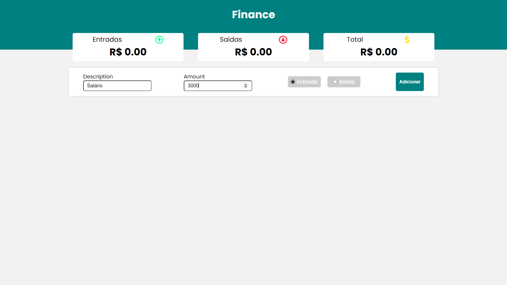
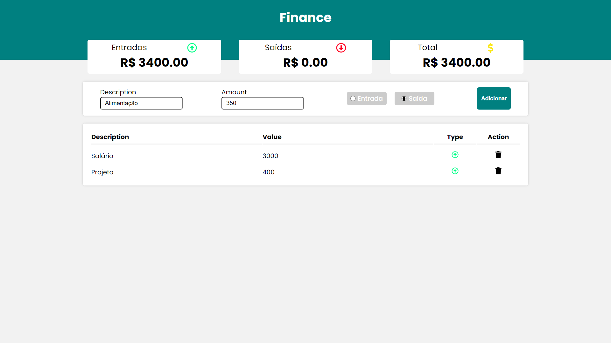
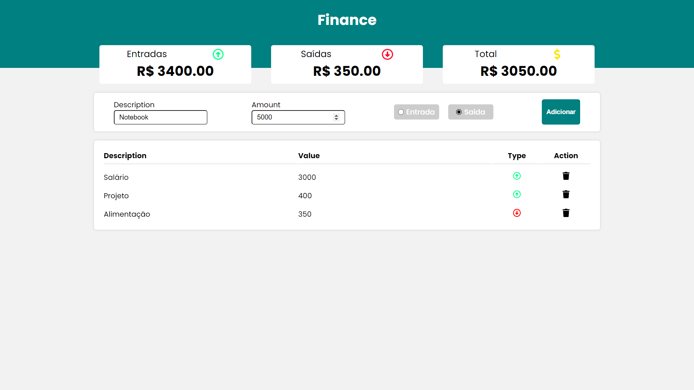
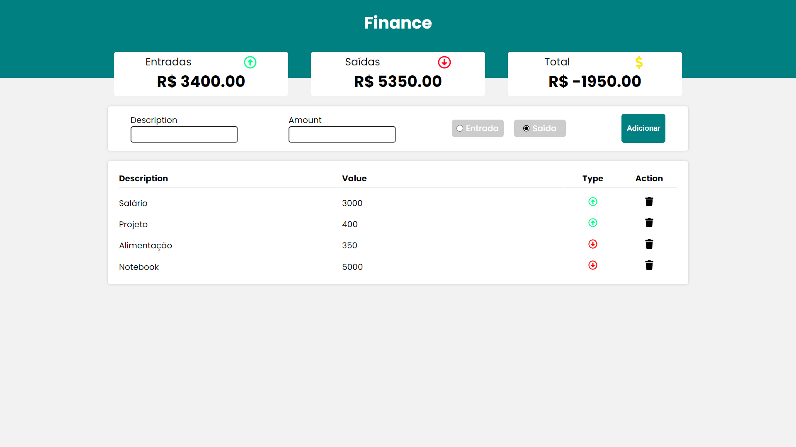

<!-- Título -->

<h1 align="center">App Finance</h1>
<div align="center">

</div>

<!-- Descrição -->

<p align="center">App Web para controle financeiro, guardando dados no LocalStorage da máquina. Opções de "Entrada" e "Saída", tendo a opção de remoção do item.</p>

<!-- Súmario -->

<p align="center">
 <a href="#demo">Demo</a> •
 <a href="#rodando-a-aplicação">Rodando A Aplicação</a> •
 <a href="#tecnologias">Tecnologias</a> •
 <a href="#autor">Autor</a>
</p>

<br>

---

<br>

## Demo

<br>

<p>Home Screen</p>


<br>

<p>Add Itens</p>


<br>

<p>Add Itens</p>


<br>

<p>Finish Screen</p>


---

<br>

## Rodando A Aplicação

<a href="https://Finance.vercel.app/" target="_blank">Acesso o site do Projeto, clicando aqui.</a>

```
https://Finance.vercel.app/
```

<br>

### Requirimentos

- [Node](https://nodejs.org/en/)
- [Yarn](https://classic.yarnpkg.com/lang/en/) or [Npm](https://www.npmjs.com/)

<br>

### Clone o repositório e acesse a pasta
```
$ git clone https://github.com/MatheusPalmieri/Finance && cd Finance
```

<br>

### Siga as etapas para rodar o Projeto em sua máquina local
```
# Para instalar as dependências necessárias
$ npm install

# Para startar projeto
$ npm start

Abra o browser na página "http://localhost:3000" para visualizar.

```
<br>

---

<br>

## Tecnologias

As seguintes ferramentas foram usadas na construção do projeto:

- [React](https://pt-br.reactjs.org/)
- [JavaScript](https://www.javascript.com/)
- [Styled-Components](https://styled-components.com/)
- [React Icons](https://react-icons.github.io/react-icons/)

<br>

---

<br>

### Autor

Create for <b>`Matheus Palmieri`</b>👨‍💻

<br>
<br>

<p align="center">App Finance Finalizado🚀</p>
